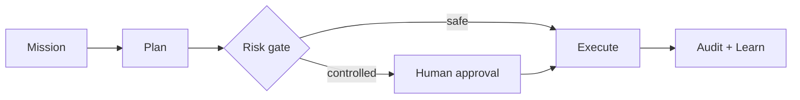

<!-- OLD-RX // PROFILE CORE -->

<div align="center">
  

  <br />

  <a href="https://github.com/Old-Rx?tab=repositories"></a>
  

  <h3>Engineering controlled intelligence into real systems.</h3>
  <p>
    AI orchestration · secure backends · modern interfaces · production automation
  </p>
</div>

---

## `SYSTEM://IDENTITY`

```text
HANDLE       : Old-Rx
FOCUS        : Auditable AI systems and full-stack products
BUILD MODE   : Architecture → Code → Test → Ship → Observe
CURRENT ARC  : RX-AI OMEGA
PRINCIPLE    : Powerful automation should remain observable and controllable
```

I build software where **AI agents, dependable APIs, thoughtful interfaces, and operational safety** meet. My current work explores mission orchestration, human approval gates, persistent execution, and production-ready delivery.

> در حال ساخت سیستم‌های هوشمند، قابل‌کنترل و آمادهٔ استفادهٔ واقعی.

## `CORE://STACK`

<div align="center">
  
</div>

<br />

| Layer | Tools I reach for | What I care about |
|---|---|---|
| Intelligence | Python · model APIs · retrieval | useful outputs, guardrails, traceability |
| Product | TypeScript · React · Vite | clarity, speed, responsive experiences |
| Platform | FastAPI · PostgreSQL · Redis | clean boundaries, durable state, secure APIs |
| Delivery | Docker · NGINX · GitHub Actions | repeatability, automation, observable releases |

## `NOW://BUILDING`

<table>
  <tr>
    <td width="64" align="center">Ω</td>
    <td>
      <strong>RX-AI OMEGA</strong><br />
      An approval-aware AI mission control platform. The current development line focuses on secure orchestration, persisted workflows, human control, memory, and production delivery.
    </td>
  </tr>
</table>



## `ENGINEERING://SIGNALS`

<div align="center">
  
  
</div>

<div align="center">
  
</div>

## `OPERATING://PRINCIPLES`

```text
01  Architecture before accidental complexity
02  Security and governance belong in the execution path
03  Tests turn confidence into evidence
04  Automation must remain observable and reversible
05  Shipping is a loop: build → verify → observe → improve
```

---

<div align="center">
  <sub>Designed and built from the Old-Rx control room.</sub><br />
  <sub>Open to thoughtful engineering conversations and ambitious systems.</sub>
</div>
