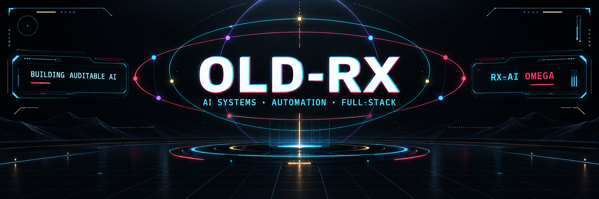
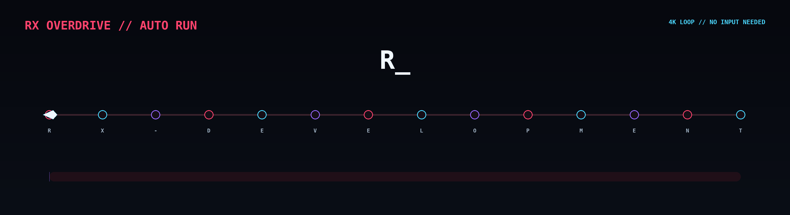
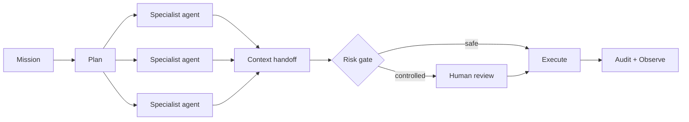
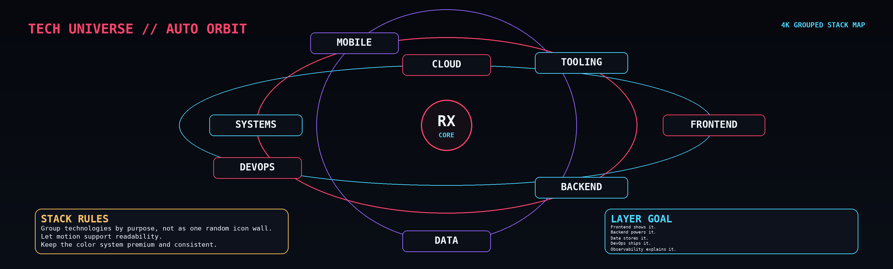
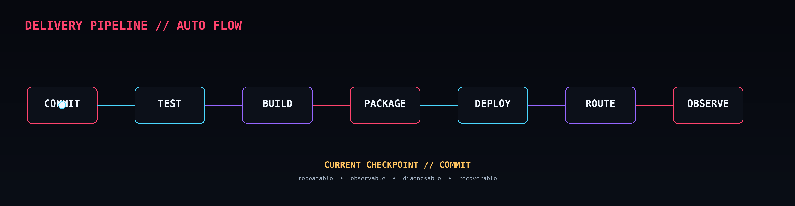
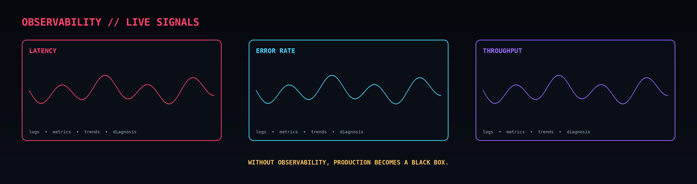
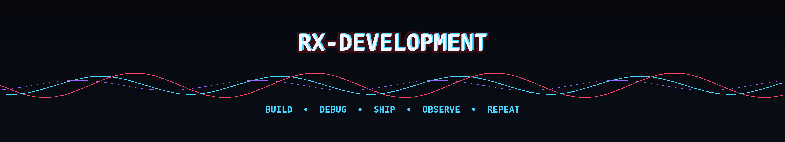

<!-- OLD-RX // PROFILE CORE -->

<div align="center">
  

  <br />

  <a href="https://github.com/Old-Rx?tab=repositories"></a>
  
  

  <h3>Engineering controlled intelligence into real systems.</h3>
  <p><strong>AI orchestration · secure backends · modern interfaces · production automation</strong></p>
  <p>ساخت سیستم‌های هوشمند، چندوظیفه‌ای، قابل‌کنترل و آمادهٔ استفادهٔ واقعی</p>
</div>

---

## `SYSTEM://IDENTITY`

```text
HANDLE       : Old-Rx
FOCUS        : Auditable AI systems and full-stack products
BUILD MODE   : Architecture → Code → Test → Ship → Observe
CURRENT ARC  : RX-AI OMEGA
MISSION      : Turn capable models into dependable software systems
PRINCIPLE    : Powerful automation should remain observable and controllable
```

I design and build systems where **AI agents, dependable APIs, thoughtful interfaces, operational safety, and delivery automation** meet. My interests span the full engineering path: understanding a problem, shaping an architecture, coordinating tools and models, implementing the product, validating it, and operating it with clear signals.

The technology catalog below is a map of the ecosystem I work with, study, or integrate. It is **not a claim of identical mastery in every listed technology**; real depth is demonstrated through shipped repositories, tests, and maintainable systems.

## `AI://MULTI-AGENT OPERATIONS`

<div align="center">
  
</div>

Modern AI work is more than sending a prompt to one model. I focus on composing specialized capabilities into a controlled workflow:

| Capability | What it enables |
|---|---|
| Multi-agent orchestration | Assign research, planning, implementation, review, and verification to specialized roles |
| Parallel task execution | Run independent work streams together while preserving a single objective |
| Tool calling | Let models use APIs, repositories, terminals, browsers, databases, and business tools |
| Context handoff | Pass structured results between agents instead of losing decisions in chat history |
| Memory and retrieval | Ground new work in project documents, durable records, and relevant prior knowledge |
| Human approval gates | Pause consequential actions before release, deployment, publication, or deletion |
| Model routing | Select cloud or local providers based on quality, privacy, speed, and cost |
| Evaluation and observability | Track outcomes, failures, latency, audit events, and opportunities to improve |

### AI models and coding assistants

<div align="center">
  
  
  
  
  
  
  
  
  
</div>

### AI engineering areas

`Agents` · `Prompt design` · `Structured outputs` · `Tool use` · `RAG` · `Vector search` · `Memory` · `Model evaluation` · `Guardrails` · `Human-in-the-loop` · `Audit trails` · `Provider abstraction` · `Local models` · `Vision workflows` · `Automation`

**Model ecosystem radar:** OpenAI GPT · Anthropic Claude · Google Gemini · Meta Llama · Mistral · DeepSeek · Cohere · open-source Hugging Face models · Ollama-hosted local models. The goal is provider-aware integration—not treating every model as interchangeable.

## `NOW://BUILDING`

<table>
  <tr>
    <td width="72" align="center"><h2>Ω</h2></td>
    <td>
      <strong>RX-AI OMEGA</strong><br />
      An approval-aware AI mission control platform. Its current development line explores authenticated operations, persistent mission workflows, dependency-aware execution, model providers, knowledge memory, human control, auditability, testing, and production delivery.
    </td>
  </tr>
</table>



## `TECH://UNIVERSE`

<div align="center">
  
</div>

<details open>
<summary><strong>Programming language atlas</strong></summary>

<br />

<div align="center">
  
</div>

| Family | Languages | Typical territory |
|---|---|---|
| Systems and native | C, C++, Rust | operating systems, embedded software, engines, performance-sensitive services |
| Application and enterprise | C#, Java, Kotlin, Swift, Dart | business software, JVM/.NET services, mobile and desktop applications |
| Web and product | JavaScript, TypeScript, PHP, Ruby | browser applications, APIs, product development, automation |
| Data, AI, and science | Python, R, MATLAB | AI systems, data workflows, numerical analysis, automation |
| Cloud and concurrency | Go, Elixir, Scala | network services, distributed systems, concurrent applications |
| Functional and language design | Haskell | pure functional systems, strong typing, compilers, modeling |
| Scripting and operations | Bash, PowerShell, Perl, Lua | system automation, glue code, text processing, embedded scripting |
| Decentralized applications | Solidity | smart contracts and blockchain execution |
| Data foundations | SQL, HTML, CSS | data queries, document structure, interface presentation |

**Additional language ecosystems on the radar:** Assembly, Fortran, COBOL, Julia, Nim, Zig, Erlang, OCaml, F#, Clojure, Groovy, Objective-C, Visual Basic, and domain-specific languages. The right choice depends on the runtime, platform, team, safety requirements, and lifecycle of the system.

</details>

<details>
<summary><strong>Frontend, UI, and interactive product engineering</strong></summary>

<br />

<div align="center">
  
</div>

`Responsive UI` · `Component architecture` · `State management` · `Design systems` · `Accessibility` · `Forms` · `Dashboards` · `Data visualization` · `Realtime interfaces` · `Performance` · `Testing` · `Progressive enhancement`

</details>

<details>
<summary><strong>Backend, APIs, and service architecture</strong></summary>

<br />

<div align="center">
  
</div>

`REST APIs` · `Authentication` · `Authorization` · `Validation` · `Service boundaries` · `Background jobs` · `Queues` · `WebSockets` · `Error handling` · `API documentation` · `Rate limiting` · `Security headers`

</details>

<details>
<summary><strong>Databases, memory, and data platforms</strong></summary>

<br />

<div align="center">
  
</div>

`Relational modeling` · `Transactions` · `Migrations` · `Indexes` · `Caching` · `Document storage` · `Vector retrieval` · `Search` · `Backups` · `Data lifecycle` · `Access control`

</details>

<details>
<summary><strong>DevOps, cloud, delivery, and observability</strong></summary>

<br />

<div align="center">
  
</div>

`CI/CD` · `Containers` · `Infrastructure as code` · `Reverse proxies` · `TLS` · `Cloud deployment` · `Secrets` · `Health checks` · `Metrics` · `Logs` · `Tracing` · `Alerts` · `Rollback planning`

</details>

<details>
<summary><strong>Programming tools and development workflow</strong></summary>

<br />

<div align="center">
  
</div>

`Git workflows` · `Code review` · `Issues and pull requests` · `Debugging` · `Profiling` · `API testing` · `Package management` · `Build systems` · `Documentation` · `Architecture decisions` · `Automated quality checks`

**Extended tool belt:** Cursor · Windsurf · Jupyter · Swagger/OpenAPI · DBeaver · pgAdmin · Docker Desktop · browser developer tools · Sentry · shell environments · linters · formatters · type checkers · test runners · profilers · security scanners.

</details>

<details>
<summary><strong>AI, machine learning, and visual computing libraries</strong></summary>

<br />

<div align="center">
  
</div>

`Model integration` · `Inference services` · `Data preparation` · `Classical ML` · `Deep learning` · `Computer vision` · `Evaluation` · `Experiment tracking` · `Responsible deployment`

</details>

## `DELIVERY://PIPELINE`

<div align="center">
  
</div>

Good engineering does not end when code runs locally. The delivery loop should be repeatable and understandable:

```text
DISCOVER → DESIGN → IMPLEMENT → REVIEW → TEST → BUILD → PACKAGE
        → DEPLOY → VERIFY → OBSERVE → IMPROVE
```

- Quality gates: formatting, linting, types, tests, coverage, dependency checks, and reproducible builds.
- Release controls: versioning, changelogs, artifacts, configuration validation, migrations, and rollback paths.
- Production readiness: least privilege, secure secrets, backups, health checks, metrics, logs, and incident visibility.

## `OBSERVABILITY://LIVE SIGNALS`

<div align="center">
  
</div>

| Signal | The question it answers |
|---|---|
| Logs | What exactly happened? |
| Metrics | How is the system behaving over time? |
| Traces | Where did time go across services? |
| Evaluations | Is the AI output useful, grounded, and safe? |
| Audit events | Who or what initiated each consequential transition? |
| Alerts | When does a human need to act? |

## `GITHUB://SIGNALS`

<div align="center">
  
</div>

<div align="center">
  
  
</div>

## `OPERATING://PRINCIPLES`

```text
01  Architecture before accidental complexity
02  Security and governance belong in the execution path
03  Tests turn confidence into evidence
04  AI output needs context, evaluation, and human judgment
05  Automation must remain observable and reversible
06  Use the right model and tool for the job
07  Shipping is a loop: build → verify → observe → improve
```

---

<div align="center">
  
  <br />
  <sub>Designed and built from the Old-Rx control room.</sub><br />
  <sub>Open to thoughtful engineering conversations and ambitious systems.</sub>
</div>
